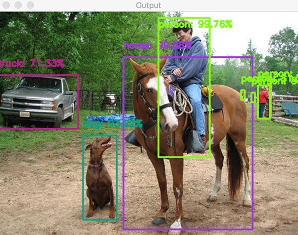

<table align="center"><tr><td align="center" width="9999"> 

# Deep Learning com Modulo OpenCV DNN

*Jonathan Chrysostomo Cabral Bonette*
</td></tr></table>

Por meio do deep learning, exploramos uma ampla gama de análises, desde as mais simples até as mais complexas. Este estudo visa destacar mais uma aplicação do OpenCV, destacando suas diversas funcionalidades. Em futuras análises, é possível demonstrar como o código é versátil e realizar análises em tempo real, como foi feito em exemplo utilizando a webcam e a verificação dos itens ao redor em tempo real, mas também é possível incluir detecção de máscaras, cores, quantidades e formas, alinhando-se com o estudo de deep learning. A escolha do OpenCV como ferramenta baseou-se em sua facilidade de uso e alta aplicabilidade nos tempos atuais. Os temas abordados já são discutidos academicamente há algum tempo, e é inspirador ver projetos que utilizam deep learning e processamento digital de sinais. Exemplos incluem análises de séries temporais, domínio da frequência, modelos de memória a longo prazo (LTSM), detecção de itens de produção falhos por processamento digital de imagens e aprendizado profundo, além de análise de imagem digital em patologia da mama, indo desde técnicas de processamento de imagem até inteligência artificial, e também investigação experimental de deep learning para processamento digital de sinais em comunicações de fibra óptica de curto alcance. O objetivo central desta análise foi utilizar o módulo <strong>OpenCV DNN</strong> para examinar padrões em imagens, ou seja, aplicar deep learning. Os estudos enfocaram essa análise para fins de estudo, utilizando a webcam para filtrar cores de elementos gráficos e realizar uma análise quantitativa dos elementos filtrados. Esse processo integrou os conceitos adquiridos nos útimos estudos, com ênfase no reconhecimento de padrões e deep learning e inteligência artificial. Para alcançar esse objetivo, foi empregado um modelo de rede neural treinado no conjunto de dados <strong>ImageNet</strong>, usando o framework <strong>Caffe</strong>, com a tarefa de identificação atribuída ao módulo <strong>DensNet121</strong>. Vale ressaltar que o banco de dados treinado possui mais de 1.000 classes, aumentando significativamente a probabilidade de reconhecimento dos padrões utilizados.

<strong>REFERÊNCIAS</strong>

  <a href="https://learnopencv.com/getting-started-with-opencv/">https://learnopencv.com/getting-started-with-opencv/</a> 
  <a href="https://www.sciencedirect.com/science/article/abs/pii/S1537511018307785">https://www.sciencedirect.com/science/article/abs/pii/S1537511018307785</a> 
  <a href="https://www.sciencedirect.com/science/article/abs/pii/S1931524417302955">https://www.sciencedirect.com/science/article/abs/pii/S1931524417302955</a> 
  <a href="https://ieeexplore.ieee.org/abstract/document/9195215">https://ieeexplore.ieee.org/abstract/document/9195215</a> 

